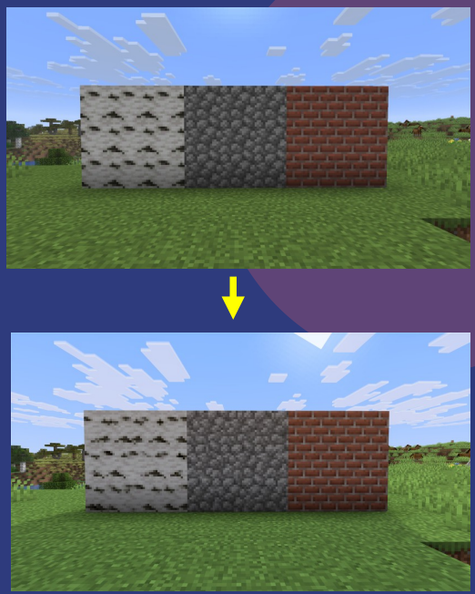

# Projet-Stage-LIRMM-2026---Application-d-adaptation-de-synth-se-de-texture

Stage LIRMM 2026 : le but est de créer une application permettant d'inclure, dans un shader Minecraft d'entrée, un algorithme de synthèse de texture créé par des stagiaires de l'année précédente, et de rendre cela compatible quel que soit le shader.

# Texture Synthesis Implementer

Outil qui **injecte automatiquement la synthèse de texture** dans n'importe quel
shaderpack Minecraft (Iris / OptiFine), pour supprimer la répétition visible des
textures de blocs sur les grandes surfaces.

> Projet de stage — LIRMM 2026 équipe ICAR.

## Le problème

Dans Minecraft, une grande surface (mur de pierre, sol de terre…) répète la même
texture 16×16 à l'identique → un effet de damier artificiel. La **synthèse de
texture** (tiling & blending) casse cette répétition en recombinant la texture de
façon pseudo-aléatoire, pour un rendu naturel.

<!-- Mets ici une image AVANT / APRÈS, c'est le meilleur argument visuel -->


## Ce que fait l'outil

À partir de **deux entrées** :
- un **atlas** de blocs (`.png`, exporté depuis ta version de Minecraft) ;
- un **shaderpack** (dossier *ou* `.zip`) ;

il produit un **nouveau shaderpack** prêt à l'emploi, avec le code de synthèse
injecté, déposé directement dans ton dossier `shaderpacks`.

### Fonctionnalités
- Injection automatique dans des shaders **variés** (analyse du code GLSL : variable
  de couleur, `#include`, plusieurs `main()`…).
- Compatibilité **GLSL 1.20 → 4.50**.
- **Activation/désactivation in-game** de la synthèse (option `TEXTURE_SYNTHESIS`).
- Sortie en **dossier ou `.zip`**.
- Interface au **thème Minecraft**, bilingue **FR / EN**.

## Installation

Prérequis : **Python 3.10+**.

```bash
pip install customtkinter numpy pillow pygame
```

## Utilisation

```bash
cd app
python app.py
```

1. **Atlas** : choisis le `.png` de l'atlas de blocs de ta version.
   <!-- explique en 1 ligne comment l'obtenir : F3+S dans Minecraft, dossier debug -->
2. **Shaderpack** : choisis le dossier ou le `.zip` du pack à modifier.
3. (Options : `ZIP` pour une sortie compressée, `DEBUG` pour les logs détaillés.)
4. Clique sur **Générer**. Le pack modifié apparaît dans `shaderpacks`.
5. Dans Minecraft : sélectionne le pack `..._SDT`, et active/désactive la synthèse
   dans **Shader Pack Settings**.

## Comment ça marche

L'outil sépare **interface** et **moteur** :

- `app/` — l'interface graphique (customtkinter).
- `SDT/` — le moteur, indépendant de l'interface :
  - `InjectSDTcode.py` — copie le pack et orchestre l'injection ;
  - `pythonLibs/Searchers.py` — analyse les shaders (trouve les `main()`, la
    variable couleur, la version GLSL, les uniforms) ;
  - `pythonLibs/Injectors.py` — insère le code SDT au bon endroit ;
  - `pythonLibs/sdt/` & `SDT450/` — les libs GLSL de synthèse ;
  - `regen_uvhints.py` — recalcule la table de correspondance blocs → atlas.

## Limites connues
- Certains shaders très exotiques peuvent ne pas être supportés.
- Le mode MULTI-SHADER attend un dossier **contenant plusieurs** shaderpacks.

## Auteurs
- PHULPIN Nathan , ARDOUIN Ethan — stage LIRMM 2026 équipe ICAR.

## Sources & inspiration

- Technique de synthèse de texture inspirée de
  [ComplementaryReimagined (OkistanPro)](https://github.com/OkistanPro/ComplementaryReimagined/tree/main).
